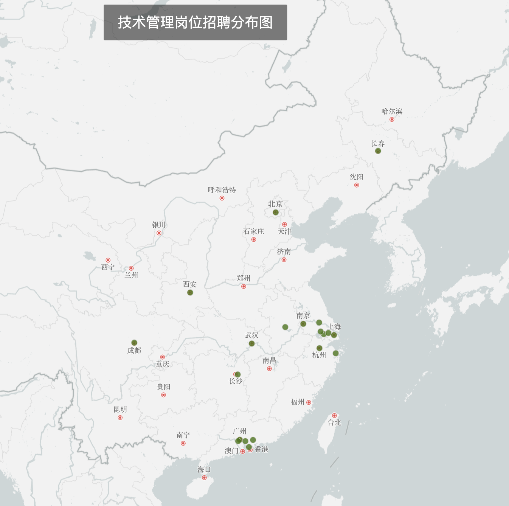
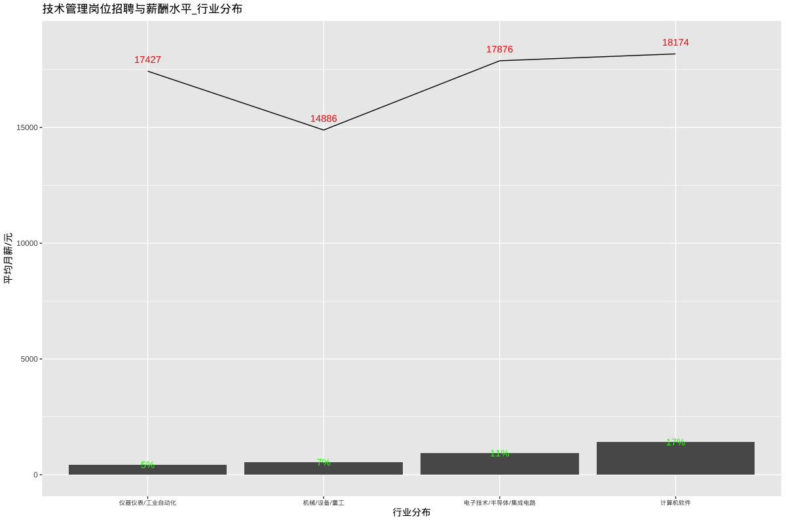
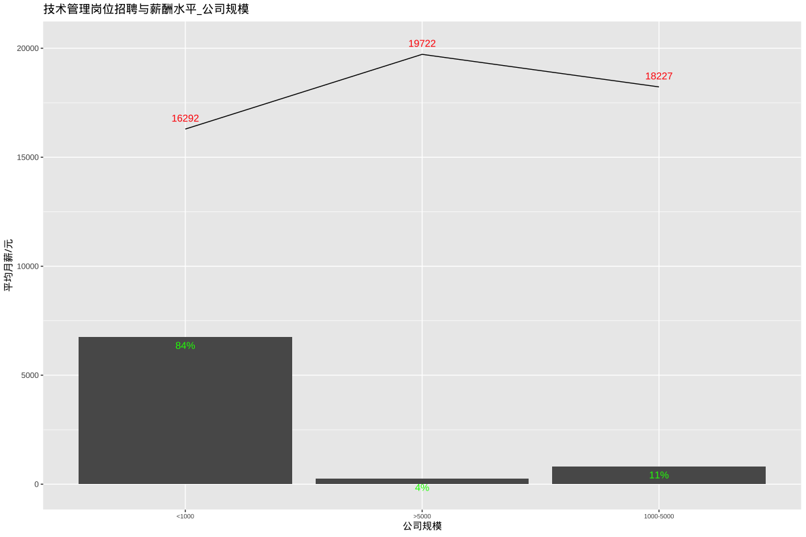
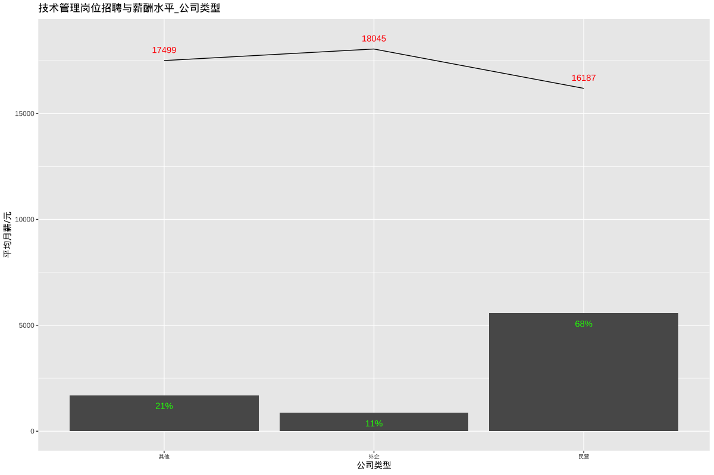
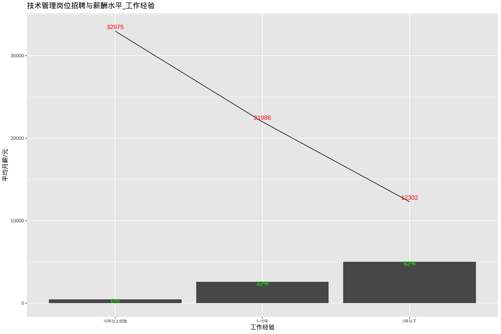
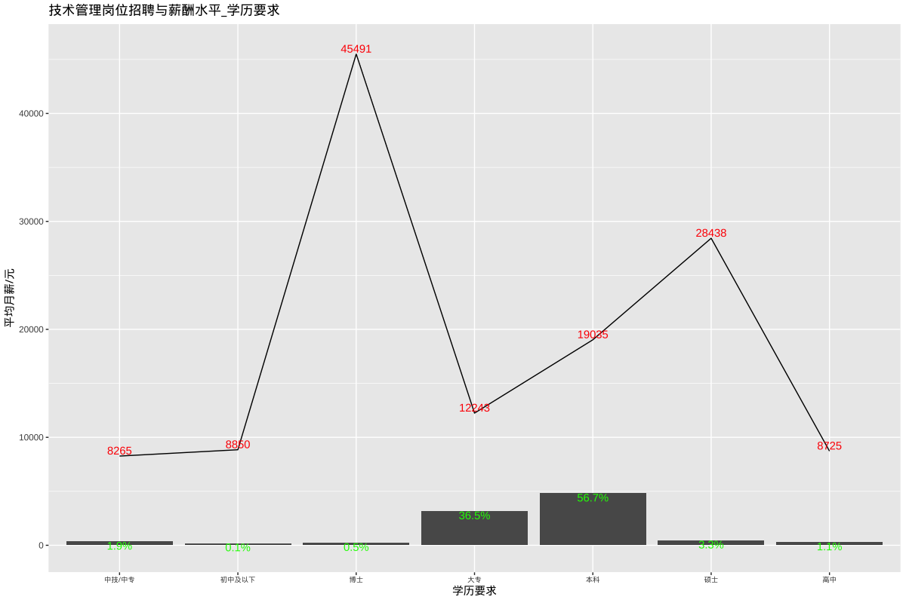

# 技术管理岗位招聘和薪酬

## 总述

本次采集有效数据8138条(城市发布量\>=100),主要分析技术管理相关岗位，如：项目经理、项目助理、技术总监、研发总监、Java开发经理、项目专员、项目工程师等。我们将从如下方面分析：

-   01.城市分布：招聘需求主要集中在上海、深圳、广州，分别占市场需求的20%、16%、11%，平均月薪分别为19509元、18790元、16038元；其余城市均在6%及以下。

-   02.行业分布：招聘需求最多的排名前两位是计算机软件和电子技术/半导体/集成电路，分别为17%和11%，平均月薪分别为18174元和17876元。

-   03.公司规模：\<1000人企业占84%，平均月薪16292元；1000-5000人占11%，平均月薪18227元。

-   04.公司类型：民企占68%，平均月薪16187元；外企占11%，平均月薪18045元。

-   05.工作经验：5年以下占62%，平均月薪12302元；5-10年占32%，平均月薪21986元。

-   06.学历要求：本科占57%，平均月薪19035元；大专占37%，平均月薪12243元。

## 01.城市分布

## 02.行业分布

## 03.公司规模

## 04.公司类型

## 05.工作经验

## 06.学历要求

